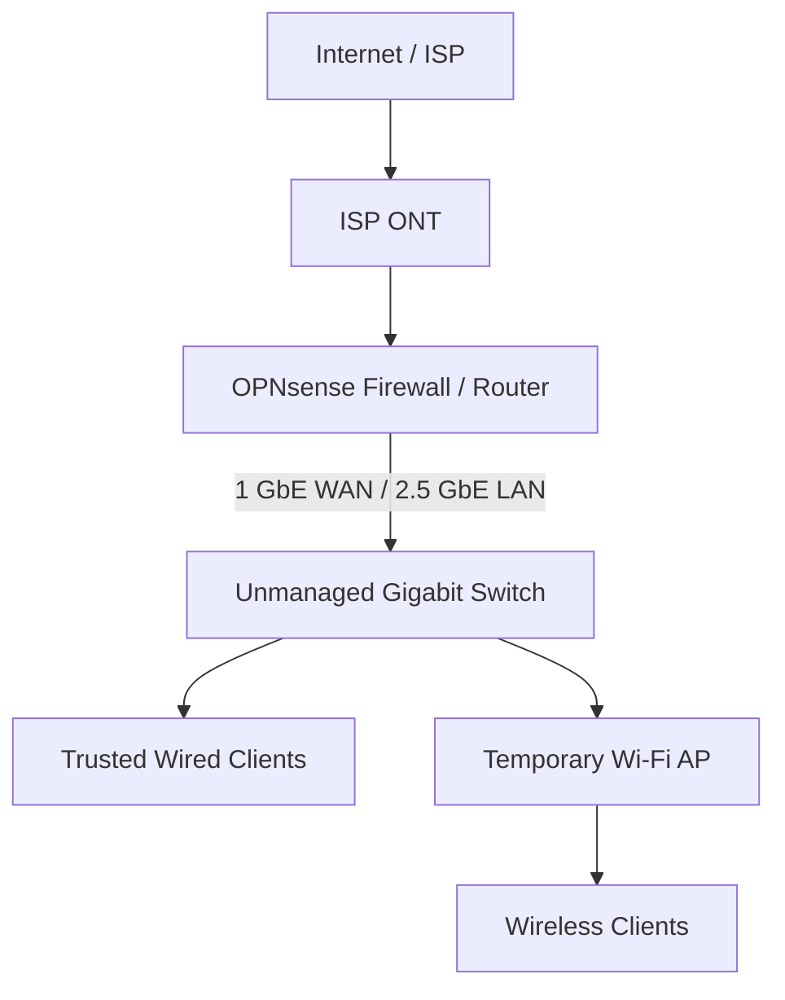

# FWP-001 — OPNsense Home Firewall

Replacing an ISP-provided router with a dedicated OPNsense firewall/router while documenting the design, migration, security hardening, testing, rollback strategy, and troubleshooting process.

[← Back to Fun Weekend Projects](https://github.com/tiwaolagbaju/fun-weekend-projects)

> **Portfolio note:** Public documentation is intentionally sanitized. Exact public/internal addresses, hostnames, SSIDs, MAC addresses, credentials, configuration backups, and other operational details are not included.

## At a Glance

| Item | Result |
|---|---|
| **Goal** | Replace the ISP router with a dedicated OPNsense edge firewall/router |
| **Status** | ✅ Initial migration phase complete |
| **Connectivity** | IPv4 and native IPv6 validated |
| **Production performance** | ~937.64 Mbps down / ~919.77 Mbps up / 7 ms average latency |
| **DNS security** | DNSSEC, encrypted upstream DNS-over-TLS, filtering, and direct DNS-bypass controls |
| **WAN validation** | 0 open TCP ports in the tested 1,056-port IPv4 service range |
| **Recovery** | OPNsense and ISP-router recovery configurations retained privately |

## Project Summary

The goal of this project was to replace the ISP-provided edge router with a dedicated OPNsense firewall while preserving reliable Internet access, maintaining near-gigabit performance, improving DNS and firewall controls, and creating a repeatable rollback path.

The implementation was built and validated in stages: baseline documentation, isolated lab testing, security hardening, direct ISP cutover, temporary wireless restoration, IPv6 validation, DNS-enforcement testing, external exposure testing, and final production verification.

## Final Architecture

The former ISP router is no longer performing routing, NAT, DHCP, or DNS functions. It is temporarily reused only for wireless access while OPNsense remains the network gateway and policy-enforcement point.

## Hardware

- Dedicated x86-64 mini PC running OPNsense
  - AMD Ryzen 7 5700U
  - 16 GB RAM
  - 512 GB SSD
  - Intel-based 2.5 GbE LAN interface
  - Realtek-based 1 GbE WAN interface
- Verizon Fios 1 Gig Internet service
- Ethernet handoff from the ONT
- 8-port unmanaged Gigabit Ethernet switch for the current single trusted segment
- Former ISP router temporarily repurposed as a downstream wireless access point

## Key Security Controls

- OPNsense installed as the primary edge router/firewall
- HTTPS-only WebGUI administration
- SSH disabled
- Dedicated administrator account with TOTP MFA
- DNS rebind and HTTP referrer protections retained
- `home.arpa` used for the internal domain
- Unbound DNS resolver with DNSSEC validation
- DNS-over-TLS for encrypted upstream DNS transport
- DNS blocklist with automated refresh
- IPv4 client DNS enforcement
  - clients allowed to query OPNsense
  - direct external TCP/UDP 53 blocked
  - direct external TCP 853 blocked
- Equivalent IPv6 DNS-enforcement policy
- No user-defined WAN pass rules
- No Destination NAT / port-forward rules
- Public-WAN private-network and bogon protections enabled
- External service-port scan passed full-stealth validation for the tested range

> DNS-over-HTTPS over TCP/443 is not claimed as blocked by the current ruleset and remains a possible future improvement.

## Performance Results

### Baseline — ISP Router

| Metric | Average |
|---|---:|
| Latency | 7 ms |
| Download | 936.75 Mbps |
| Upload | 881.10 Mbps |

### OPNsense Lab — Double NAT

| Metric | Average |
|---|---:|
| Latency | 9 ms |
| Download | 915.72 Mbps |
| Upload | 876.97 Mbps |

Even through the temporary double-NAT lab topology, throughput remained within 5% of the baseline target.

### OPNsense Production — Direct ISP Handoff

| Metric | Average |
|---|---:|
| Latency | 7 ms |
| Download | 937.64 Mbps |
| Upload | 919.77 Mbps |

Compared with the original wired baseline:

- Download was effectively unchanged
- Upload measured higher during the production test window
- Average latency remained unchanged

The final deployment therefore met the performance target without a meaningful routing/firewall throughput penalty.

## Validation Performed

The final production environment was validated from both wired and wireless clients.

- Public IPv4 WAN lease obtained directly from the ISP
- Wired DHCP, DNS, routing, and Internet access validated
- Wireless clients received OPNsense-issued DHCP leases through the temporary AP
- OPNsense confirmed as the first IPv4 routing hop
- Native IPv6 connectivity validated end-to-end
- IPv6 traceroute and AAAA-record resolution validated
- Direct IPv4 DNS-bypass attempts blocked
- Direct IPv4 DNS-over-TLS bypass blocked
- Direct IPv6 DNS-bypass attempts blocked
- Direct IPv6 DNS-over-TLS bypass blocked
- External TCP service-port scan passed full-stealth validation across the tested service-port range
- Automatic power recovery tested successfully after AC loss
- Fresh configuration backups created after major milestones

## Troubleshooting Highlights

This project intentionally documents problems as well as successful configuration steps.

### Premature topology change

An early cutover attempt connected the new firewall and former ISP router in the wrong sequence, causing wireless clients to lose Internet access. The network was rolled back, the migration procedure was rewritten, and the direct OPNsense WAN path was validated before any downstream AP conversion was attempted again.

### Unexpected client subnet

During temporary AP validation, a client unexpectedly received addressing from a different private subnet. Client-side `ipconfig /all`, gateway inspection, and DHCP-server identification revealed that an unintended routing device had been placed in the path instead of the expected unmanaged switch. Replacing it with the intended Layer-2 switch restored the expected OPNsense DHCP and gateway behavior.

### Misleading external scan

An initial external port scan showed non-stealth responses. Investigation revealed that NordVPN was active on the test client, meaning the scan was testing the VPN exit endpoint rather than the OPNsense WAN. The result was discarded, the VPN was disabled, the public endpoint was revalidated, and the scan was repeated successfully against the actual firewall.

These issues reinforced the importance of validating assumptions at each network layer rather than relying only on the intended physical diagram.

## Skills Demonstrated

- OPNsense / FreeBSD firewall deployment
- TCP/IP networking
- IPv4 and IPv6
- DHCP and DNS
- DNSSEC and DNS-over-TLS
- Stateful firewall policy design
- Packet capture and traffic validation
- NAT and WAN exposure review
- Network performance benchmarking
- Layer-2 vs. Layer-3 troubleshooting
- ISP router replacement and cutover planning
- Change management and rollback planning
- Security hardening
- MFA administration
- Technical documentation
- Root-cause troubleshooting

## Documentation

Detailed implementation notes are maintained in the `docs/` directory:

- [`docs/pre-migration-network.md`](docs/pre-migration-network.md) — original environment and performance baseline
- [`docs/target-architecture.md`](docs/target-architecture.md) — target design and future segmentation plan
- [`docs/installation.md`](docs/installation.md) — OPNsense installation, NIC assignment, lab testing, performance, and power recovery
- [`docs/security-hardening.md`](docs/security-hardening.md) — MFA, DNSSEC, DoT, DNS filtering/enforcement, IPv6, backups, and WAN exposure validation
- [`docs/cutover-rollback.md`](docs/cutover-rollback.md) — migration sequence, temporary AP conversion, rollback process, and final production validation

## Project Outcome

The initial migration phase is complete.

OPNsense is now operating as the primary edge router/firewall on the direct ISP Ethernet handoff. Wired and wireless clients use OPNsense for routing, DHCP, DNS, and firewall policy. IPv4 and native IPv6 are operational, production throughput remains at approximately Gigabit service levels, DNS-bypass controls have been validated for both IP families, external WAN exposure testing passed for the tested TCP service-port range, and current recovery backups are available privately.

## Future Updates

FWP-001 is complete as an initial production deployment, but the home network will continue to evolve. Future changes will be documented here as they are implemented and validated rather than presented as completed work in advance.

### Planned Roadmap

- [ ] Replace the unmanaged switch with a managed VLAN-capable core switch
- [ ] Create separate Trusted, IoT, Guest, and Server/NAS VLANs
- [ ] Add VLAN-aware wireless access points
- [ ] Build least-privilege inter-VLAN firewall policies
- [ ] Restrict firewall administration to a dedicated management path
- [ ] Add centralized logging, monitoring, and alerting
- [ ] Add UPS-backed power for the firewall, switch, and networking stack
- [ ] Evaluate DNS-over-HTTPS control options
- [ ] Perform additional IPv6-focused external exposure validation
- [ ] Continue documenting performance, security tests, configuration changes, and troubleshooting lessons

As each item is completed, the related documentation and architecture diagrams will be updated and the roadmap item will be marked complete.

## References and Resources

The following resources were used during the design, configuration, validation, or troubleshooting of this project:

- [OPNsense Documentation](https://docs.opnsense.org/) — installation, interfaces, firewall configuration, Unbound DNS, diagnostics, and packet capture
- [Verizon Fios — Using Your Own Router](https://community.verizon.com/kb/articles/1696146-using-your-own-router-with-verizon-fios) — ISP-router DHCP lease release and direct ONT handoff guidance
- [GRC ShieldsUP](https://www.grc.com/shieldsup) — external IPv4 WAN exposure testing
- [OISD](https://oisd.nl/) — DNS blocklist source used with Unbound
- [Cloudflare 1.1.1.1 Documentation](https://developers.cloudflare.com/1.1.1.1/) — upstream DNS and encrypted DNS service documentation

### Inspiration

The initial idea for replacing the ISP-provided router with OPNsense was inspired by a NetworkChuck walkthrough. The final implementation was expanded beyond the original walkthrough to include production IPv6 validation, DNSSEC, DNS-over-TLS, DNS-bypass enforcement for IPv4 and IPv6, TOTP MFA, performance benchmarking, rollback planning, automatic power recovery, external WAN exposure testing, and production troubleshooting.

---

**FWP-001** is part of my [Fun Weekend Projects](https://github.com/tiwaolagbaju/fun-weekend-projects) series: practical IT, networking, infrastructure, automation, and cybersecurity projects built to strengthen hands-on skills and document the engineering process from design through validation.